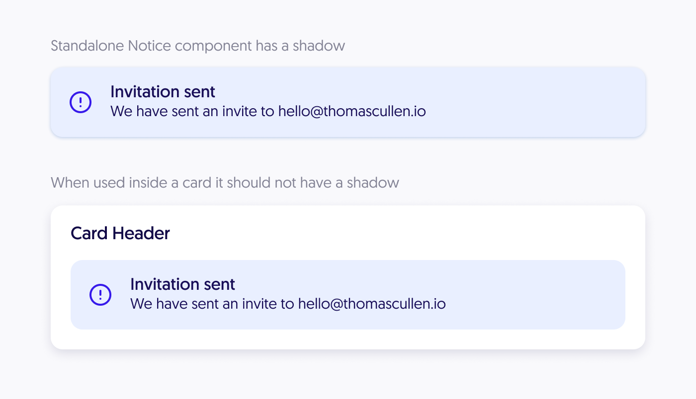

I have been a big fan of styled-components for a while now. It's been my go to
styling library for all my most recent projects. Over the years I have adopted
various patterns for developing components and I have been using this pattern
for quite a while now. Let's get to it.

Imaging we have a "Notice" component which when rendered on its own has a
shadow. However, when we render a notice inside of a 'Card' component we don't
want there to be any shadow.



One way to tackle this would be to add a "shadow" prop to the Notice component
to control it and that would be a perfectly valid way to solve this problem but
there is another way that prevents us from remembering to have to do this every
time we render a Notice inside of a Card. We can make this a style decision of
the Card component itself by updating the Card styles to override the styles for
any nested notices. We can easily do this with styled components by referencing
the Notice component inside of our Card styles.

```jsx
import styled from "styled-components"

const Notice = styled.div`
	...

	box-shadow: 2px 0 4px rgba(0, 0, 0, 0.2);
`

const Card = styled.div`
  ... ${Notice} {
    box-shadow: none;
  }
`
```

But this only works because in this case the Notice component is a styled
component. What happens if our Notice component is a little more complex and
the main Notice component is just a regular react component. We need to be able
to access the styled components that Notice renders. This is why I choose to
always export my styled components as named exports along with the primary
component. I also always prefix all of my styled components with "Styled".
This makes it really easy to determine what is a styled component and what is
not.

```jsx
export const StyledNotice = styled.div`
  box-shadow: 2px 0 4px rgba(0, 0, 0, 0.2);
`

function Notice({ children }) {
  <StyledNotice>{children}</StyledNotice>
}
```

Now inside of the code for our card component, we can simply import the styled
components that Notice renders to override the styles for any Notice component
that are rendered inside of a Card.

```jsx
import styled from "styled-components"
import { StyledNotice } from "../Notice"

const Card = styled.div`
  ... ${StyledNotice} {
    box-shadow: none;
  }
`
```
